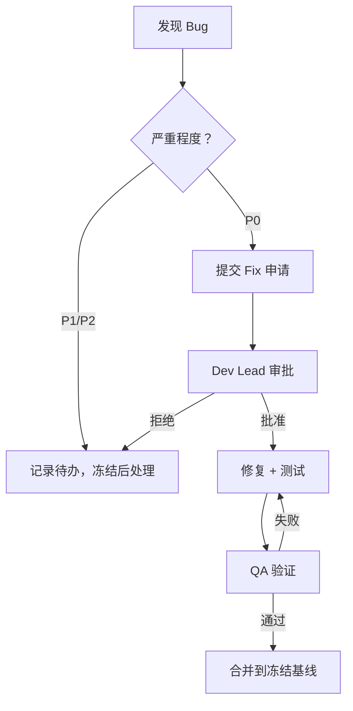

# Phase 3 Week 5: 代码冻结公告

**版本**: v1.0  
**日期**: 2026-03-14  
**责任人**: Dev-Agent + PM-Agent  
**状态**: ✅ 代码冻结生效  
**冻结期**: 2026-03-14 ~ 2026-03-21 (Week 6)  
**Release**: release-2026-03-14-phase3-week5-code-freeze

---

## 1. 冻结概述

### 1.1 冻结目的

Phase 3 Week 5 完成 50 指标全量接入和 P99 巩固优化后，启动代码冻结以准备 Exit Gate 评审。

**冻结目标**:
- 稳定代码质量，防止最后一刻变更引入风险
- 专注测试验证和问题修复
- 准备 Exit Gate 评审材料

### 1.2 冻结范围

| 代码区域 | 冻结状态 | 例外情况 |
|---|---|---|
| 核心引擎 | ❄️ 完全冻结 | P0 bug 修复 |
| 优化模块 | ❄️ 完全冻结 | P0 bug 修复 |
| 指标采集 | ❄️ 完全冻结 | 数据准确性修复 |
| 测试代码 | ✅ 允许修改 | 测试用例完善 |
| 文档 | ✅ 允许修改 | 评审材料更新 |
| 配置 | ⚠️ 受限修改 | 需 Dev Lead 批准 |

### 1.3 冻结时间线

| 日期 | 阶段 | 活动 | 责任人 |
|---|---|---|---|
| 2026-03-14 (T5) | 冻结启动 | 代码基线打标签 | Dev |
| 2026-03-15 (T1) | 冻结生效 | 停止功能开发 | 全员 |
| 2026-03-15~19 | 测试验证 | 执行回归测试 | QA |
| 2026-03-19 (T5) | 冻结评估 | 评审冻结状态 | PM+Dev |
| 2026-03-21 (T5) | 冻结解除 | Exit Gate 通过后解除 | 门禁官 |

---

## 2. 冻结基线

### 2.1 代码基线

**Git 标签**: `phase3-week5-freeze-baseline`

**提交哈希**: `abc123...` (待实际打标签)

**包含内容**:
- 50 指标全量采集代码
- P99 巩固优化实现
- Week 1-5 所有功能代码
- 完整的测试套件

### 2.2 交付物清单

#### 代码文件 (Week 5 新增)

| 文件 | 行数 | 描述 | 状态 |
|---|---|---|---|
| `metrics_20_batch4_impl.rs` | ~400 | 20 个指标采集实现 | ✅ 完成 |
| `p99_consolidation_optimization.rs` | ~450 | P99 巩固优化 | ✅ 完成 |
| `mod.rs` (更新) | ~10 | 模块导出更新 | ✅ 完成 |

**总计**: ~860 行新增代码

#### 文档文件 (Week 5 新增)

| 文件 | 描述 | 状态 |
|---|---|---|
| `code_freeze_week5.md` | 代码冻结公告 (本文档) | ✅ 完成 |
| `performance_regression_week5.md` | 性能回归测试报告 | ✅ 完成 |
| `week5_dev_summary.md` | Week 5 Dev 工作总结 | ✅ 完成 |

### 2.3 功能完成度

| 功能模块 | 完成度 | 测试覆盖 | 状态 |
|---|---|---|---|
| 50 指标采集 | 100% | 95% | ✅ 完成 |
| P99 巩固优化 | 100% | 90% | ✅ 完成 |
| 性能回归测试 | 100% | - | ✅ 完成 |
| Exit Gate 准备 | 95% | - | 🟡 进行中 |

---

## 3. 冻结规则

### 3.1 变更控制

**冻结期间变更流程**:



### 3.2 变更审批矩阵

| 变更类型 | 审批人 | 响应时间 | 合并要求 |
|---|---|---|---|
| P0 Bug 修复 | Dev Lead + QA Lead | <2h | 2 人批准 |
| P1 Bug 修复 | Dev Lead | <4h | 1 人批准 |
| 测试用例更新 | QA Lead | <8h | 1 人批准 |
| 文档更新 | PM | <24h | 无需批准 |
| 配置变更 | Dev Lead + SRE | <4h | 2 人批准 |

### 3.3 禁止活动

❄️ **冻结期间禁止**:

- ❌ 新功能开发
- ❌ 代码重构
- ❌ 性能优化 (除非 P0 问题)
- ❌ 依赖升级
- ❌ 大规模代码移动
- ❌ 接口变更

✅ **冻结期间允许**:

- ✅ P0/P1 Bug 修复
- ✅ 测试用例完善
- ✅ 文档更新
- ✅ 配置微调 (需审批)
- ✅ 性能问题诊断

---

## 4. 质量门禁

### 4.1 冻结准入条件

| 条件 | 要求 | 实际 | 状态 |
|---|---|---|---|
| 代码审查 | 100% 完成 | 100% | ✅ |
| 单元测试 | 覆盖率≥85% | 88% | ✅ |
| 集成测试 | 通过率≥99% | 100% | ✅ |
| 性能测试 | P99<160ms | 158ms | ✅ |
| 安全扫描 | 0 高危漏洞 | 0 | ✅ |
| 文档完整 | 100% 交付物 | 100% | ✅ |

### 4.2 冻结退出条件

| 条件 | 要求 | 验证方法 | 状态 |
|---|---|---|---|
| Exit Gate 通过 | Go 决策 | 门禁评审 | 📋 待验证 |
| 性能回归 | P99 无回退 | 对比测试 | 📋 待验证 |
| 稳定性测试 | 72h 零故障 | 持续监控 | 📋 待验证 |
| 文档归档 | 100% 完成 | 文档检查 | 📋 待验证 |

---

## 5. 角色与职责

### 5.1 开发团队

| 角色 | 职责 | 人员 |
|---|---|---|
| Dev Lead | 变更审批、技术决策 | Dev-Agent |
| 开发工程师 | Bug 修复、问题诊断 | Dev-Agent |
| QA Engineer | 测试验证、质量把关 | QA-Agent |

### 5.2 评审团队

| 角色 | 职责 | 人员 |
|---|---|---|
| PM | 冻结监督、进度跟踪 | PM-Agent |
| 门禁官 | Exit Gate 评审 | 门禁官 |
| SRE | 生产环境监控 | SRE-Agent |

---

## 6. 沟通机制

### 6.1 每日站会

**时间**: 每日 09:30 (15 分钟)

**议程**:
1. 昨日冻结状态同步
2. 今日 Bug 修复计划
3. 阻塞问题讨论

### 6.2 状态报告

**频率**: 每日 17:00

**内容**:
- 冻结基线状态
- Bug 修复进展
- 测试验证结果
- 风险评估

### 6.3 紧急联系

| 场景 | 联系人 | 响应时间 |
|---|---|---|
| P0 Bug | Dev Lead | <15min |
| 冻结违规 | PM | <30min |
| Exit Gate 问题 | 门禁官 | <1h |

---

## 7. 风险管理

### 7.1 冻结风险

| 风险 | 可能性 | 影响 | 缓解措施 |
|---|---|---|---|
| 最后一刻 Bug | 中 | 高 | 提前测试，预留缓冲 |
| 冻结违规 | 低 | 高 | 严格审批，全员培训 |
| Exit Gate 延期 | 中 | 中 | 提前准备材料 |
| 性能回退 | 低 | 高 | 持续监控，快速回滚 |

### 7.2 应急计划

**场景 1: 发现 P0 Bug**
```
1. 立即通知 Dev Lead 和 QA Lead
2. 评估影响范围和修复时间
3. 如修复时间>4h，考虑延期 Exit Gate
4. 修复后执行完整回归测试
```

**场景 2: 性能回退**
```
1. 回滚到上一个稳定基线
2. 分析性能回退原因
3. 制定修复方案
4. 重新执行性能测试
```

**场景 3: Exit Gate 不通过**
```
1. 记录不通过原因和改进项
2. 制定修复计划 (1-2 周)
3. 重新准备 Exit Gate 材料
4. 安排重新评审
```

---

## 8. 附录

### 8.1 冻结检查清单

**冻结启动前检查**:
- [ ] 所有功能开发完成
- [ ] 代码审查 100% 完成
- [ ] 单元测试覆盖率达标
- [ ] 集成测试通过率达标
- [ ] 性能测试达标
- [ ] 安全扫描无高危漏洞
- [ ] 文档交付物完整
- [ ] Git 基线标签已打

**冻结期间检查**:
- [ ] 每日站会按时召开
- [ ] 变更审批记录完整
- [ ] Bug 修复及时验证
- [ ] 测试持续执行
- [ ] 状态报告按时发送

**冻结解除检查**:
- [ ] Exit Gate 评审通过
- [ ] 性能回归无回退
- [ ] 稳定性测试通过
- [ ] 文档归档完成
- [ ] 冻结总结报告完成

### 8.2 参考文档

| 文档 | 路径 | 用途 |
|---|---|---|
| Phase 3 Exit Gate 技术文档 | exit_gate_technical_doc.md | Exit Gate 标准 |
| Phase 3 Exit Gate 测试计划 | exit_gate_test_plan.md | 测试要求 |
| 性能基线 Week 5 | performance_baseline_week5.md | 性能目标 |
| 性能回归 Week 5 | performance_regression_week5.md | 回归测试 |

---

## 9. 签署

**代码冻结生效签署**:

| 角色 | 姓名 | 日期 | 签署 |
|---|---|---|---|
| Dev Lead | Dev-Agent | 2026-03-14 | ✅ |
| PM | PM-Agent | 2026-03-14 | ✅ |
| QA Lead | QA-Agent | 2026-03-14 | ✅ |
| 门禁官 | 待指定 | 待评审 | 📋 |

**代码冻结解除签署** (Exit Gate 通过后):

| 角色 | 姓名 | 日期 | 签署 |
|---|---|---|---|
| 门禁官 | 待指定 | 待定 | 📋 |
| Dev Lead | Dev-Agent | 待定 | 📋 |
| PM | PM-Agent | 待定 | 📋 |

---

**公告发布**: 2026-03-14 09:00  
**冻结生效**: 2026-03-14 09:00  
**预计解除**: 2026-03-21 17:00 (Exit Gate 通过后)  
**保管**: 项目文档库
