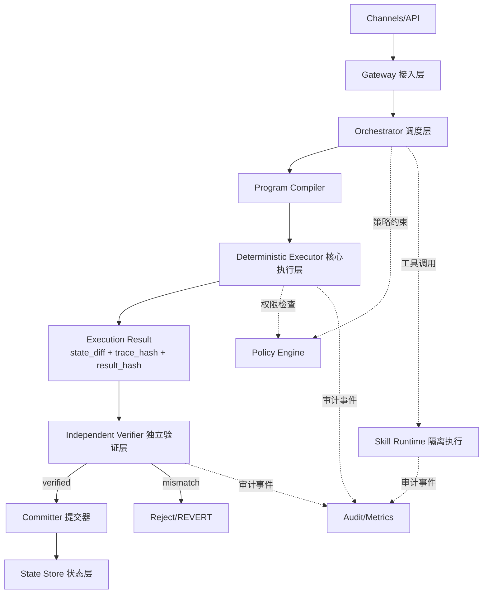

# 团队评审一页版框架图（目标-架构-里程碑-KPI）

## 0) 一句话定位
构建一个**可验证执行 + 可治理演化**的 Agent 基础设施：上层智能可快速迭代，下层可信内核保持稳定与可审计。

---

## 1) 目标（Goals）

### G1. 可信执行
- 相同输入（`program + input + state_root`）必须得到相同输出。
- 所有状态变更必须经过验证后提交（执行阶段仅产出 `state_diff`）。

### G2. 可治理
- 高风险能力默认拒绝，显式授权。
- 关键参数与规则变更通过标准提案流程，支持回滚。

### G3. 可扩展
- 能力扩展走技能层，不侵入核心执行语义。
- 算力分层（Core / Skill / Inference）以兼顾安全与成本。

### G4. 可运营
- 全链路可观测（请求、规划、执行、验证、提交）。
- 用量、成本、风险三类指标可量化。

---

## 2) 架构（Architecture）

### 分层职责（评审口径）
- **接入层**：身份识别、请求标准化、速率限制。
- **调度层**：任务规划与工具选择（可非确定）。
- **执行层**：确定性指令执行，输出可重算结果。
- **验证层**：独立重放，不一致即拒绝提交。
- **治理层（横切）**：权限、提案、审计、风险分级。

---

## 3) 里程碑（Milestones）

| 阶段 | 时间窗 | 交付物 | 退出标准（Go/No-Go） |
|---|---|---|---|
| M1 可信执行 MVP | Q1 | 最小指令集执行器 + 重放验证 + 哈希结果 | 核心场景重放一致率 `>= 99.9%`，未验证提交率 `= 0`（按第 8.1 口径） |
| M2 安全与隔离 | Q2 | RBAC/ABAC、技能沙箱、审计链路、回滚机制 | 高危误放行率 `<= 0.1%`（且 95% 置信上界 `<= 0.1%`），关键路径审计覆盖率 `= 100%` |
| M3 生态扩展 | Q3 | Skill Manifest/签名、分层算力接入、多模型路由 | 技能接入成功率 `>= 99%`，扩展后一致率下降 `<= 0.1%`，门禁样本量达标 |
| M4 治理规模化 | Q4 | 参数治理与提案流程、多节点验证、灰度发布 | 高危策略变更覆盖“提案-测试-灰度-回滚”闭环 `= 100%`，灰度失败自动回滚成功率 `>= 99%` |

---

## 4) KPI（评审用核心指标）

> 说明：本节所有指标分母定义、统计窗口、最小样本量、置信约束，统一以第 `8.1` 与 `8.1.1` 为准。

### 4.1 可信性 KPI（必须项）
- **重放一致率**：核心流程 `>= 99.99%`（目标值，且满足最小样本量）。
- **未验证提交率**：`= 0`（红线指标）。
- **状态提交回滚成功率**：`>= 99.9%`。

### 4.2 安全性 KPI（红线项）
- **高危误放行率**：`<= 0.1%`（且 95% 置信上界 `<= 0.1%`）。
- **高危拦截时延 P95**：`< 300ms`。
- **漏洞修复 MTTR**：按严重级别设定 SLA（P0/P1/P2）。

### 4.3 性能与成本 KPI（增长项）
- **执行延迟 P95**：按任务分层设定（轻量/重量/高危）。
- **验证延迟 P95**：`< 2s`（MVP 基线，按风险分层统计）。
- **单位任务成本**：按模型/工具类型持续下降。

### 4.4 生态健康 KPI（可持续项）
- **高质量技能占比**：持续上升。
- **技能接入成功率**：`>= 99%`。
- **生态扩张后稳定性回归时间**：在既定 SLA 内。

---

## 5) 评审结论模板（可直接在会上使用）

### 当前阶段判断
- 结论：`Go / Conditional Go / No-Go`
- 主要依据：`可信性`、`安全性`、`可运营性` 三项是否达标。

### 本阶段风险 Top 3
1. `__________`
2. `__________`
3. `__________`

### 下一阶段准入条件
- 条件 A：`__________`
- 条件 B：`__________`
- 条件 C：`__________`

---

## 6) 边界与非目标（防止范围失控）
- 不以“工具/通道数量”作为阶段成功标准。
- 不在验证机制未稳定前开放高危自动执行。
- 不将业务灵活性需求下沉到核心执行语义层。

---

## 7) 评审决议（当前版本）

### 整体判断
- **结论：Conditional Go**。
- **判断依据**：方案已清晰分离“非确定智能（规划）”与“确定执行（提交）”，且具备 `Verifier -> Committer` 硬闸门；评审与放行统一采用第 `8.1/8.1.1` 统计口径。

### 可行性评估
- **M1（高）**：前提是严格收敛 MVP 范围（最小指令集、单一状态模型、有限场景集）。
- **M2（中高）**：RBAC/ABAC + 沙箱 + 审计链路路径成熟，难点在策略质量与误拦截成本。
- **M3（中）**：生态扩展会放大一致性与治理复杂度，需要更强准入机制。
- **M4（中）**：多节点验证/灰度发布可做，但对组织流程与运维能力要求最高。

### 主要风险 Top 3（已确认）
1. **确定性泄漏**：时间、随机数、外部 API、模型温度等导致“同输入不同输出”。
2. **验证层瓶颈**：`Independent Verifier` 成为延迟与成本热点，影响 P95 和吞吐。
3. **治理规则漂移**：策略高频变更但缺少回放基线，导致误放行或误拒绝。

### 关键建议（按优先级）

#### P0（立即执行）
- 定义并冻结**确定性契约**：`program + input + state_root + env_fingerprint`。
- 禁用隐式时钟/随机；外部调用统一走可重放适配层。
- 副作用改为**两阶段**：执行阶段仅产出 `intent_log/state_diff`，提交后异步外部落地（Outbox 模式）。
- 为 `Policy Engine` 增加**策略测试门**：高危样本、边界样本、对抗样本回放全部通过方可发布；发布门禁高危样本量需满足 `N >= 1000`。

#### P1（下一阶段）
- 验证层采用**分级验证**：低风险快速验证，高风险全量重放。
- 实施并行验证与 `trace_hash` 结果缓存，控制验证成本与时延。
- 技能生态引入**准入三件套**：Manifest、签名、最小权限声明；未声明能力默认拒绝。

#### P2（运营闭环）
- 增补两类运营指标：
  - SLO 违约归因（模型/工具/策略/基础设施）。
  - 策略变更导致事故率（用于治理反馈闭环）。

### 准入条件（阶段门）
- **条件 A**：完成确定性契约与回放基线（覆盖核心场景）。
- **条件 B**：未验证提交率在最近 `14` 天持续 `= 0`，并连续通过 `2` 次双周关卡，且具备自动化守卫。
- **条件 C**：高危策略变更具备“提案-测试-灰度-回滚”闭环，且发布门禁满足最小样本量与置信约束。

---

## 8) 执行计划与步骤阶段（含量化准入/准出）

### 8.1 统一度量口径（先冻结）
- **统计窗口**：日常监控使用最近 `7` 天滚动窗口；发布门禁使用最近 `14` 天窗口。
- **最小样本量（分层）**：
  - 功能回归（核心场景）：`N >= 200`（含正常/边界/对抗样本）。
  - 发布门禁（高危相关指标）：高危样本 `N >= 1000`；不足样本只允许修复发布。
- **通过判定（三元约束）**：指标必须同时满足“目标阈值 + 分位约束（P95/P99）+ 红线零违规”。
- **统计置信约束**：红线类比例指标需满足“95% 置信上界 <= 阈值”；仅点估计达标不视为通过。
- **连续达标时长**：用于阶段放行的红线指标，需在最近 `14` 天内连续通过 `2` 次双周关卡。

### 8.1.1 指标分母定义（评审固定口径）
- **高危误放行率** = 误放行高危请求数 / 全部高危请求数。
- **未验证提交率** = 未经过 `Verifier` 即提交的请求数 / 全部提交请求数。
- **未声明能力拦截率** = 被拦截的未声明能力调用数 / 全部未声明能力调用数。
- **验证一致率** = 验证通过且重放一致请求数 / 全部进入验证请求数。

### 8.2 分阶段执行计划

| 阶段 | 目标与步骤 | 准入标准（Entry Gate） | 准出标准（Exit Gate） |
|---|---|---|---|
| Phase 0：基线冻结（2~3 周） | 1) 冻结确定性契约；2) 建立黄金回放集；3) 接入全链路观测ID | 已有最小可运行链路（Gateway→Executor→Verifier→Committer）；核心日志字段完整率 `>= 95%` | `env_fingerprint` 覆盖率 `= 100%`；回放样本 `N >= 200`；关键事件追踪覆盖率 `= 100%` |
| Phase 1：可信执行 MVP（4~6 周） | 1) 最小指令集；2) 执行仅产出 `state_diff`；3) 验证后提交 | Phase 0 全部通过；隐式时间/随机调用扫描“阻断模式”已启用 | 重放一致率 `>= 99.9%`；未验证提交率 `= 0`；`result_hash` 覆盖率 `= 100%`；核心场景回归通过率 `>= 98%` |
| Phase 2：安全与隔离（4~6 周） | 1) RBAC/ABAC；2) Skill 沙箱；3) 审计链与回滚 | Phase 1 全部通过；高危动作清单与分级策略已评审 | 高危误放行率 `<= 0.1%`（且 95% 置信上界 `<= 0.1%`）；高危拦截 P95 `< 300ms`；关键路径审计覆盖率 `= 100%`；回滚成功率 `>= 99.9%` |
| Phase 3：验证层扩容（4~5 周） | 1) 分级验证；2) 并行验证；3) trace 缓存 | Phase 2 全部通过；验证任务已按风险分级 | 验证延迟 P95 `< 2s`；验证吞吐提升 `>= 2x`（相对 Phase 2 基线）；验证一致率 `>= 99.99%`（满足最小样本量） |
| Phase 4：生态扩展（6~8 周） | 1) Manifest/签名；2) 准入三件套；3) 分层算力接入 | Phase 3 全部通过；技能发布流程和审核SOP已上线 | 技能接入成功率 `>= 99%`；未声明能力拦截率 `= 100%`；扩展后一致率下降 `<= 0.1%` |
| Phase 5：治理规模化（6~8 周） | 1) 提案-测试-灰度-回滚；2) 多节点验证；3) 发布治理 | Phase 4 全部通过；治理流程责任人和SLA已明确 | 高危策略变更测试覆盖率 `= 100%`；灰度失败自动回滚成功率 `>= 99%`；策略变更事故率环比下降 `>= 30%` |

### 8.3 阶段间强制门禁（Hard Gates）
- **Gate-1（可信红线）**：未验证提交率必须持续 `= 0`（最近 `14` 天、连续 `2` 次双周关卡），否则禁止进入下一阶段。
- **Gate-2（安全红线）**：高危误放行率若 `> 0.1%`，或 95% 置信上界 `> 0.1%`，只允许修复发布，不允许功能扩展。
- **Gate-3（治理红线）**：高危策略变更若未经过“提案-测试-灰度-回滚”闭环，禁止上线。
- **Gate-4（样本红线）**：发布门禁所需最小样本量未达标（尤其高危样本 `N < 1000`）时，不得判定“功能扩展通过”。

### 8.4 评审与放行节奏
- **周评审**：跟踪领先指标（覆盖率、延迟、误拦截、回放失败原因）。
- **双周关卡**：对照 Entry/Exit Gate 做阶段放行决策（Go/Conditional Go/No-Go）。
- **月度复盘**：输出 Top 3 风险变化、门禁触发次数、治理改进项关闭率。

### 8.5 门禁触发后的标准处置（Runbook）
- **触发后 24 小时内**：冻结功能扩展分支，仅保留修复发布通道。
- **触发后 48 小时内**：完成根因归类（模型/工具/策略/基础设施）并给出修复方案与责任人。
- **恢复放行条件**：对应 Gate 指标在最近 `14` 天窗口内恢复达标，且连续通过 `2` 次双周关卡。

### 8.6 机器执行版配套文档
- 规则清单与判定逻辑：[doc/ci_release_gate_checklist.md](doc/ci_release_gate_checklist.md)
- 规则配置样例（可直接用于规则引擎）：[doc/gate_rules.example.yaml](doc/gate_rules.example.yaml)
- 门禁结果输出契约（JSON Schema）：[doc/gate_report_schema.json](doc/gate_report_schema.json)
- 分阶段详细执行蓝图（需求/架构/开发/测试/部署/验收）：[doc/phase_detailed_execution_blueprint.md](doc/phase_detailed_execution_blueprint.md)
